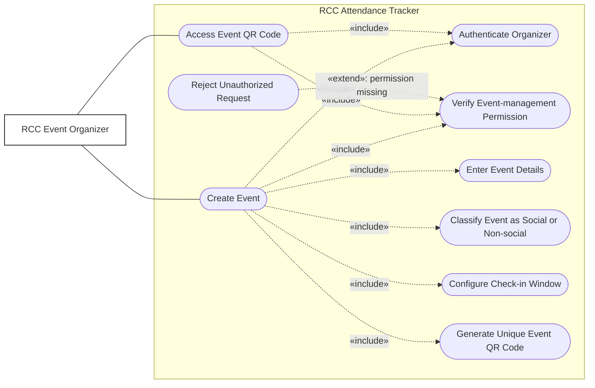

# Use Case: Create Event

An **RCC Event Organizer** is any authenticated user who has permission to register and manage RCC events. The organizer
does not have to be an E-Board member; the role is determined by the user's assigned permissions.

Before an event can be created or its QR code accessed, the system authenticates the organizer and verifies that they
have event-management permission. Attempts from users without that permission are rejected so that members cannot create
unofficial events to manipulate active-member status.

When creating an event, the organizer must provide the date, time, location, and other required metadata. They must also
classify the event as either **Social** or **Non-social**. This category is stored with the event and is later used to
calculate whether members have satisfied the active-member requirements for the semester.

The check-in window can be configured as a separate step during the **Create Event** use case. The unique QR code is
generated after the required event information has been supplied. **Access Event QR Code** is shown separately because
an authorized organizer may return later to display or distribute it.

