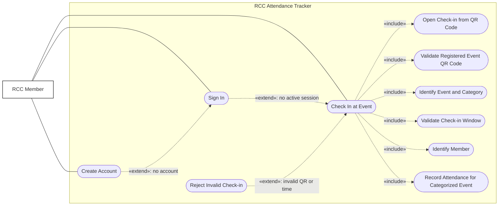

# Use Case: Member Check-in

This diagram represents the three potential authentication situations:

- With an active session, the system identifies the member and continues the check-in automatically.
- Without an active session, the member must sign in and receive a valid session token before the check-in can complete.
- Without an account, the member must create an account as an extension of the sign-in use case.

The QR code identifies a registered RCC event. Because every registered event is classified as either **Social** or
**Non-social**, resolving the event also determines which category the attendance will count toward. The member follows
the same check-in process for both categories; there are not separate social and non-social check-in flows.

If the member checks in outside the configured check-in window, the request is rejected. If the member has already
checked in for this event, the request is rejected, and the user is informed that they have already checked in. If the
QR code does not identify a valid registered event, the system rejects the check-in and may display a not-found page. A
successful attendance record remains associated with the categorized event so it can later be used when calculating
active-member status.

