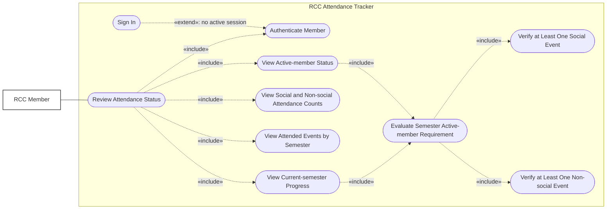

# Use Case: Checking Active Member Status

Any RCC member can check their active-member status after authenticating. The status is calculated separately for each
semester.

To become an active member for a semester, a member must attend:

- At least **one Social event**, and
- At least **one Non-social event**.

The member can view the events they attended, see separate attendance counts for each category, review their progress
toward both requirements, and view their resulting active-member status. Attending two events in the same category does
not satisfy the requirement because both category checks must pass.

